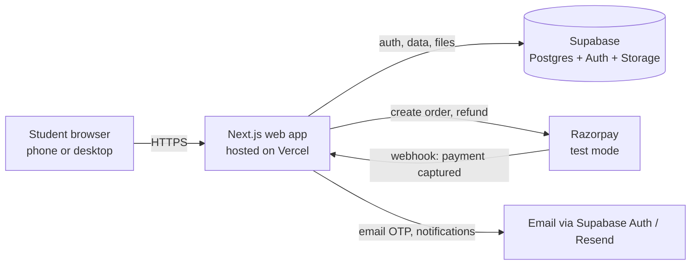
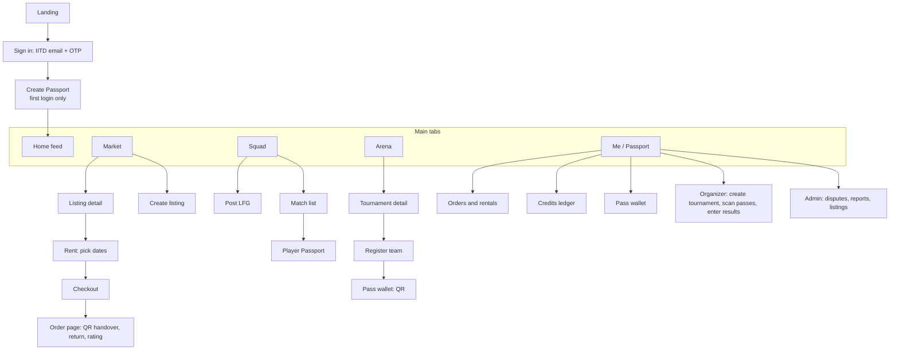
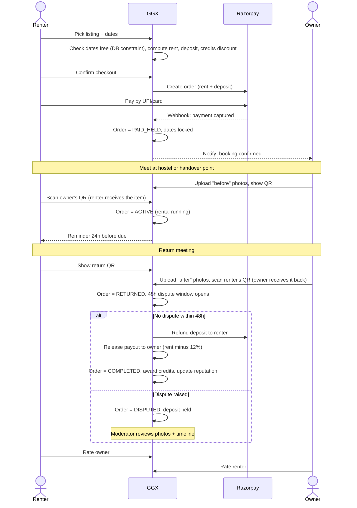
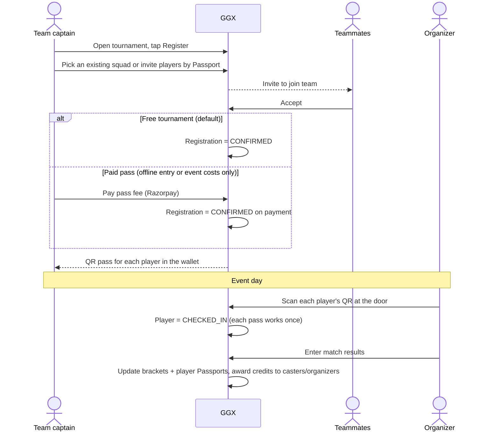
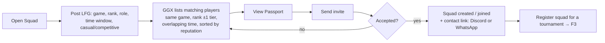
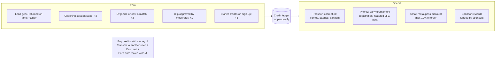
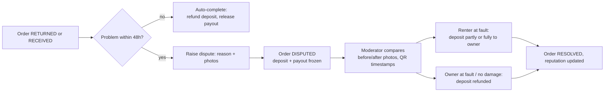
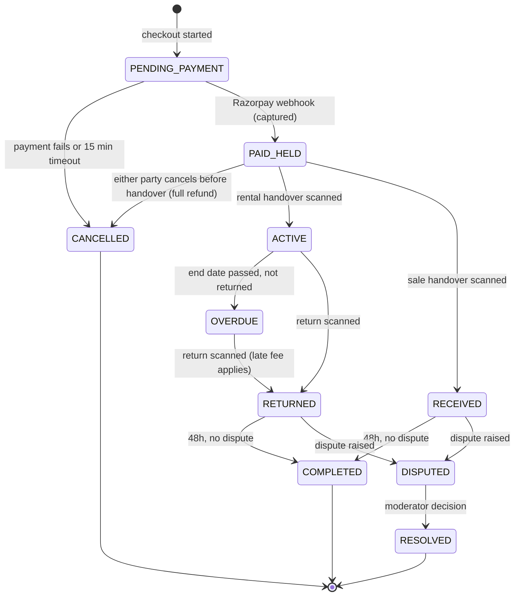
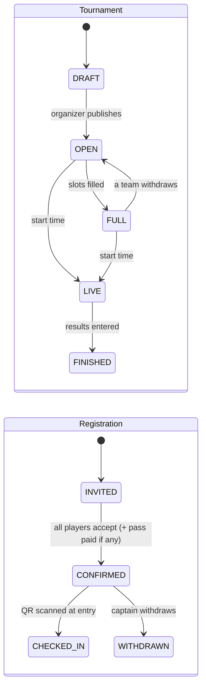
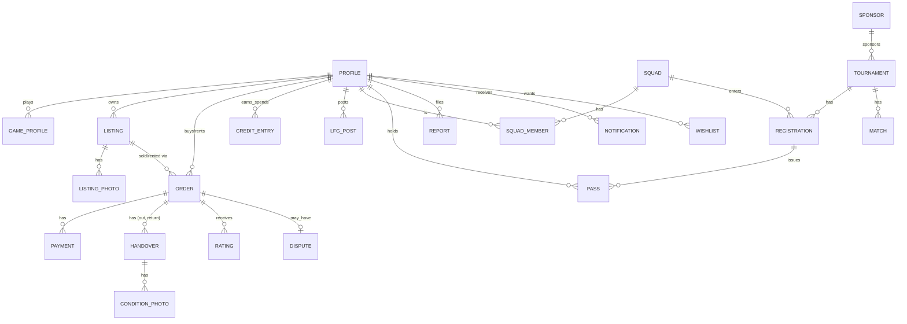

# GGX (Good Game Exchange): Functional Design (v1)

Date: 2026-10-09. Phase C of 5. Builds on [04_Requirements_Analysis.md](04_Requirements_Analysis.md); requirement IDs (FR-xx, NFR-xx) refer to that file. Wireframes are in [05b_Wireframes.html](05b_Wireframes.html).

Diagrams use Mermaid. They render in GitHub, VS Code, Notion and most Markdown viewers.

---

## 1. Design principles

1. **Every exchange leaves an audit trail.** Payment, QR handover, condition photos and ratings are linked to one order record (NFR-08).
2. **The person receiving an item confirms it.** Whoever receives the item scans the other party's QR. Nobody can mark their own handover complete.
3. **Money is held, then released.** Payments are captured at checkout but paid out only after handover (FR-31).
4. **Credits are a points ledger, not money.** Credits are earned and spent only; there is no transfer or cash-out path anywhere in the system (FR-42).
5. **Mobile first, desktop works.** One responsive layout: bottom tabs on phones, a left sidebar on desktop (NFR-01).
6. **Database rules over app code.** Constraints such as "no double-booking" and "credit balance never negative" are enforced by the database, so a bug in the app can't break them.

## 2. System architecture

| Layer | Choice | Why |
|---|---|---|
| Front end + server | Next.js (React), App Router, server actions | One codebase for UI and API; responsive; free hosting on Vercel |
| Database | Supabase Postgres | Relational data, constraints, row-level security (RLS) |
| Auth | Supabase email OTP, restricted to `@iitd.ac.in` | FR-01 with no password handling |
| File storage | Supabase Storage | Listing and condition photos |
| Payments | Razorpay Checkout (test mode); Razorpay Route models the held payout to owners | Indian UPI/card standard; test mode is safe for a class demo |
| QR | `qrcode` library to generate; browser camera scanner (`html5-qrcode`) to scan, with a 6-digit code fallback | Works on Android Chrome and iPhone Safari |
| Hosting | Vercel (app) + Supabase (data) free tiers | NFR-10 |

The original report suggested React Native/Flutter + NestJS/FastAPI. We dropped those because the project is a web app and one Next.js codebase covers front end and back end.

## 3. Navigation and screen list

| # | Screen | Who | Requirements |
|---|---|---|---|
| S01 | Landing | Everyone | n/a |
| S02 | Sign in (IITD email + OTP) | Everyone | FR-01 |
| S03 | Create / edit Passport | Student | FR-02, NFR-05 |
| S04 | Home feed | Student | FR-80 |
| S05 | Market: browse + filters | Student | FR-11 |
| S06 | Listing detail (buy or rent, availability calendar, deposit preview) | Student | FR-12, FR-13 |
| S07 | Create listing (photos, category, price, location; prohibited-item check) | Student | FR-10, FR-92 |
| S08 | Checkout (price, deposit, credits applied, Razorpay) | Student | FR-30, FR-41 |
| S09 | Order page (status timeline, show QR / scan QR, condition photos, rate, dispute) | Both parties | FR-20 to FR-23, FR-31, FR-32 |
| S10 | Squad: my LFG posts + match list | Student | FR-50, FR-51 |
| S11 | Post LFG | Student | FR-50 |
| S12 | Squad page | Student | FR-52 |
| S13 | Arena: tournament list | Student | FR-60 |
| S14 | Tournament detail (rules, slots, sponsor, bracket) | Student | FR-60, FR-64, FR-71 |
| S15 | Register team | Captain | FR-61, FR-62 |
| S16 | Pass wallet (QR passes) | Student | FR-63 |
| S17 | Me / Passport (reputation, badges, history) | Student | FR-03, FR-04 |
| S18 | Credits ledger | Student | FR-43 |
| S19 | Organizer dashboard (create tournament, registrations, check-in scanner, results) | Organizer | FR-60, FR-63, FR-64, FR-70 |
| S20 | Sponsor report | Organizer / sponsor | FR-72 |
| S21 | Admin: disputes, reports, listings, users | Admin | FR-23, FR-90, FR-91 |
| S22 | Notifications | Student | FR-81 |

## 4. Hero user flows

### F1. Rent gear (the core commerce flow)

### F2. Buy used gear

Same as F1 without dates, deposit or return:
**listing → checkout → PAID_HELD → seller shows QR → buyer scans (buyer receives) → 48h dispute window → payout to seller (price minus 8%) → COMPLETED → ratings.**

### F3. Register for a tournament and enter with a QR pass

### F4. Find teammates (LFG)

In-app chat is out of scope for the MVP (FR-53). A squad links out to an existing Discord or WhatsApp group.

### F5. Earn and spend credits

Credits are spent mostly on things that cost GGX nothing: Passport cosmetics and priority access. This follows the model of Steam's Points Shop, where points are earned and spent only on profile items. Cash-like discounts are limited to 1 credit = ₹10, max **10%** of an order (down from 30%, see Section 13). Sponsors can fund extra rewards. When a discount is used, the owner is still paid on the full price and GGX absorbs it as a marketing cost.

### F6. Dispute

## 5. State machines

### 5.1 Order (sale or rental)

| Transition | Who can trigger it | Side effects |
|---|---|---|
| → PAID_HELD | Razorpay webhook only | Lock dates; notify owner |
| → ACTIVE / RECEIVED | The receiving party, by scanning a valid QR | Timestamp; "before" photos must exist |
| → RETURNED | Owner, by scanning the renter's QR | "After" photos required; 48h timer starts |
| → COMPLETED | Scheduled job after 48h | Refund deposit, record payout, award credits, update reputation |
| → DISPUTED | Either party within 48h | Freeze money |
| → RESOLVED | Moderator | Split deposit as decided |

### 5.2 Tournament and registration

## 6. Data model

### Tables and key columns

| Table | Key columns | Rules enforced in the database |
|---|---|---|
| `profile` | id (= auth user), name, email, hostel, role (`student`/`organizer`/`admin`), suspended, created_at | Email must end in `iitd.ac.in` (check on sign-up) |
| `game_profile` | profile_id, game (`bgmi`/`valorant`/`third`), rank, role, availability | One row per user per game |
| `listing` | id, owner_id, type (`sale`/`rent`), category, title, description, condition, price (sale) or rent_per_day, item_value, location, status (`active`/`paused`/`removed`) | Price > 0; blocked keywords (FR-92) checked on insert |
| `listing_photo` | listing_id, storage_path, sort | 1-5 per listing |
| `order` | id, listing_id, buyer_id, owner_id, type, start_date, end_date, amount, deposit, credits_used, commission, status, qr_token_out, qr_token_return, returned_at | **No double-booking:** an exclusion constraint on (listing_id, date range) for orders in PAID_HELD / ACTIVE / OVERDUE. Buyer ≠ owner |
| `payment` | order_id or registration_id, razorpay_order_id, razorpay_payment_id, kind (`charge`/`refund`/`payout`), amount, status | Unique razorpay_payment_id, so a repeated webhook does nothing (NFR-07) |
| `handover` | order_id, direction (`out`/`return`), scanned_by, scanned_at | One per direction per order |
| `condition_photo` | handover_id, storage_path | At least 1 required before a scan is accepted |
| `rating` | order_id, rater_id, ratee_id, role (`seller`/`buyer`/`owner`/`renter`), recommended (yes/no), tags (e.g. `on time`, `as described`, `late`), comment | One per rater per order |
| `wishlist` | profile_id, category, keywords, max_price, type (`buy`/`rent`) | One active row per user per category; matching new listings trigger a notification |
| `dispute` | order_id, raised_by, reason, status, decision, deposit_to_owner | Only within 48h of RETURNED/RECEIVED |
| `credit_entry` | profile_id, delta, reason, ref_id, created_at | Append-only; balance (the sum) can never go below 0; no "transfer" reason exists |
| `lfg_post` | profile_id, game, rank, role, from_time, to_time, mode (`casual`/`competitive`), active | Expires at to_time |
| `squad`, `squad_member` | squad: id, name, game, captain_id. member: squad_id, profile_id | Size limit per game |
| `tournament` | id, organizer_id, sponsor_id, game, format, team_size, slots, starts_at, venue, pass_fee, prize_desc, status | pass_fee only allowed if venue is offline (FR-62) |
| `registration` | tournament_id, squad_id, status | One per squad per tournament |
| `pass` | registration_id, profile_id, qr_token, checked_in_at | Token unique; check-in only once |
| `match` | tournament_id, round, team_a, team_b, winner, score | n/a |
| `sponsor` | id, name, logo_path | n/a |
| `report` | reporter_id, target_type, target_id, reason, status | n/a |
| `notification` | profile_id, kind, body, read, created_at | n/a |

Reputation is **computed, not stored**: a database view (`reputation`) gives completed transactions, % recommended per role, on-time return rate, lost disputes and tier (tier 2 = 3+ completed, ≥90% recommended, no lost disputes).

## 7. Business logic

| Calculation | Formula (base values from Requirements, Section 7) |
|---|---|
| Rental amount | rent_per_day × days |
| Deposit | item_value × rate. Rate by value band: <₹2K: 0% (tier 2) / 30% (new); ₹2-15K: 20% / 40%; >₹15K: 25% / 50%. Capped at ₹10,000 |
| Credits discount | min(credits × ₹10, 10% of amount) |
| Buyer pays | amount − credits discount + deposit |
| Commission | 12% of amount (rent), 8% (sale) |
| Owner payout | amount − commission (credits discount is absorbed by GGX) |
| Late fee | 1.5 × rent_per_day for each late day, taken from the deposit |
| Credits for lending | +1 per rental day, only if returned on time |

**Worked example (from the original report, recalculated):** a new user rents a PS5 for 3 days at ₹350/day, item value ₹45,000.
- Rent = ₹1,050.
- Deposit = 50% × ₹45,000 = ₹22,500, capped at **₹10,000**.
- The renter spends 5 starter credits on a Passport frame, not a discount, so GGX's cost is ₹0.
- Renter pays ₹1,050 + ₹10,000 deposit.
- Commission = ₹126; owner payout = ₹924.
- GGX net = ₹126 − about ₹21 payment cost (2% of ₹1,050) = **₹105**.
- The deposit is refunded after the 48h window.
- **For comparison, the earlier design** (₹50 credit discount) left GGX ₹55, so credits ate ~48% of the margin. Cosmetic spending fixes this.
- For a tier-2 renter the deposit is still ₹10,000 at this item value (25% of ₹45,000 is ₹11,250, capped). On items under ₹15,000 the tier-2 rate halves the deposit.

## 8. Security and access (row-level security)

| Data | Who can read | Who can write |
|---|---|---|
| Profiles / Passports | Any signed-in IITD user (hostel name only; no room number or phone) | Owner of the profile |
| Listings | Any signed-in user | Listing owner; admin can remove |
| Orders, payments, handovers, photos | The two parties + admin | Server only (state changes go through server actions that check the state machine) |
| Credit ledger | Owner + admin | Server only |
| Tournament registrations, passes | Captain, team members, organizer | Server only |
| Disputes | Parties + admin | Parties create; admin decides |

Other controls: Razorpay webhook signature verified; QR tokens are random, single-use and tied to one order and direction; uploads limited to images under 5 MB; rate limits on OTP requests.

## 9. Notifications

| Event | To | Channel |
|---|---|---|
| Booking paid | Owner | In-app + email |
| Handover scanned | Both | In-app |
| Return due in 24h | Renter | In-app + email |
| Overdue | Renter, owner | In-app + email |
| Dispute window closing / completed | Both | In-app |
| Team invite | Invitee | In-app + email |
| Tournament starts in 2h | Registered players | In-app + email |
| New LFG match | Poster | In-app |
| New listing matches wishlist | Wishlisting user | In-app + email |

## 10. Requirements coverage

| Module | Requirements | Screens | Flows |
|---|---|---|---|
| Identity and Passport | FR-01 to FR-05 | S02, S03, S17 | n/a |
| Market | FR-10 to FR-13 | S05 to S08 | F1, F2 |
| Handover and trust | FR-20 to FR-23 | S09, S21 | F1, F2, F6 |
| Payments | FR-30 to FR-33 | S08, S09, S17 | F1, F2, F3 |
| Credits | FR-40 to FR-43 | S08, S18 | F5 |
| Squad | FR-50, FR-51 | S10, S11 | F4 |
| Arena | FR-60 to FR-64 | S13 to S16, S19 | F3 |
| Organizer | FR-70 | S19 | F3 |
| Home and notifications | FR-80, FR-81 | S04, S22 | all |
| Admin | FR-90 to FR-92 | S07, S21 | F6 |

All 33 must-have requirements map to at least one screen and flow. Should/could items (FR-04, FR-14, FR-15, FR-24, FR-44, FR-52, FR-65, FR-66, FR-71, FR-72) are designed but built only if time allows.

## 11. Demo data plan (for Phase D)

So the demo never shows an empty app: about 25 fictional student profiles across 6 hostels, 30 listings (12 mobile accessories, 6 controllers, 5 headsets, 3 consoles, 4 PC parts), 8 completed orders with ratings, 15 LFG posts across 3 games, 2 tournaments (one open, one finished with a bracket), and 1 fictional sponsor. All names and data are labelled as demo data in the app footer.

## 12. Open design decisions (defaults chosen; change if you disagree)

| Decision | Default |
|---|---|
| Third game | EA FC (console). It gives the console rental story a tournament |
| Handover points | Hostel name + 3 public spots (e.g. library, LHC, SAC) |
| Payout in the demo | Recorded in a payout ledger; real transfers via Razorpay Route only after go-live |
| Email sending | Supabase OTP emails for sign-in; other notifications in-app only for the MVP |

---

## 13. Founder review: what a former Steam product manager would change

*Written from the view of a senior PM who has just left Steam to start GGX. Steam references are to public features only.*

**The big lesson from Steam: win on one loop, then expand.** Steam started as a way to update Valve's own games and became a store later. GGX has five modules; a startup can make only one loop work at a time. The loop with the most frequent, lowest-risk use is **Squad → Arena**, and it's free. Market rides on that traffic. Rentals carry the most operational risk, so they launch with a small, curated set of items.

| # | Change | Steam precedent (public) | What changed in this design |
|---|---|---|---|
| 1 | **Credits buy status, not discounts.** A ₹10-per-credit discount at 30% would have eaten ~48% of GGX's margin on the PS5 example | Steam Points: earned, then spent on profile cosmetics in the Points Shop, at near-zero cost to Steam | F5 spend options; discount cap cut to 10%; worked example now nets ₹105 instead of ₹55 |
| 2 | **Wishlists as free demand data.** Without a survey, wishlists *are* our demand research: "47 students want a controller under ₹1,500" tells us what supply to recruit | Steam Wishlists: users are notified on sale, and developers use wishlist counts to forecast demand | New `wishlist` table + notification; wishlist counts feed the KPI dashboard |
| 3 | **Recommend yes/no instead of 5 stars.** Star ratings inflate (everything is 4.8); a binary choice with tags is easier to read | Steam reviews: "Recommended / Not Recommended" with a % positive score | `rating` table; tier 2 = ≥90% recommended |
| 4 | **A simple, loud guarantee.** Trust comes from a promise people can remember, not from a policy page | Steam refunds: request within 14 days and under 2 hours of play | "GGX Guarantee: not as described? Full refund within 48 hours of handover." Uses the existing dispute window (F6) |
| 5 | **Time-boxed events to fix cold start.** Demand and supply meet when they happen at the same time | Steam seasonal sales and Next Fest create concentrated spikes | "GGX Fest Week" around Esports Fury / campus fests: listing drive, free tournament, sponsor rewards. Liquidity is concentrated in one week instead of spread thin |
| 6 | **One north-star metric** | Marketplaces track completed transactions, not sign-ups | **Weekly completed exchanges** = sales + rentals returned + tournament check-ins. The pilot gates from Requirements stay as secondary KPIs |
| 7 | **Protect trades from scams from day one** | Steam has repeatedly added trade holds and confirmations to fight scams | Already in the design: escrow-style hold, QR scan by the receiving party, photos, 48h window. Kept as a must-have, not a later phase |

**What I would not copy from Steam:** a large creator Workshop, a public profile comment wall (moderation cost), or a cash-like wallet balance. A balance users can top up with money would bring RBI payment-instrument rules into scope, which is why GGX credits stay non-purchasable.

**Pitch line for the professor:** *"We copy what Steam proved works (points for status, wishlists, binary reviews, a clear refund promise, event-driven demand) and apply it to the one thing Steam can't do: physical gear and in-person competition on a verified campus."*
